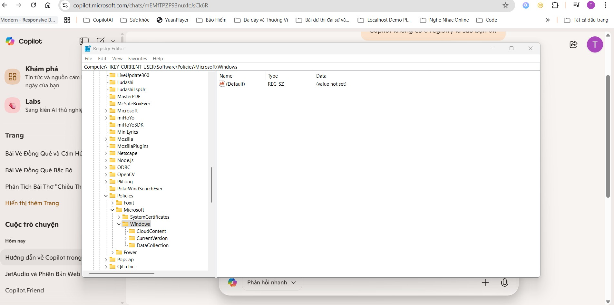

# 🛠 Copilot-Troubleshooting  
Fixing Microsoft Copilot timeout and launch errors on Windows 11 — includes rare registry workaround and PowerShell cleanup. (Việt - Anh)

---

## 🔍 Kiểm tra Registry trước khi sửa  
Before applying any fix, check this registry path:
HKEY_CURRENT_USER\Software\Policies\Microsoft\Windows

👉 Nếu **không thấy thư mục `WindowsCopilot`**, thì rất có thể đây là nguyên nhân khiến Copilot bị treo hoặc báo lỗi:

> `"Copilot error: The request took longer than expected. Please ensure you're online and try again."`

✅ Trong trường hợp đó, bạn có thể áp dụng giải pháp sau để khôi phục Copilot.

---

## ✅ Giải pháp từng bước | Step-by-step Fix

### 🔧 1. Tạo key registry  
Create this registry path manually:
HKEY_CURRENT_USER\Software\Policies\Microsoft\Windows\WindowsCopilot

Add a DWORD value:
TurnOffWindowsCopilot = 0

📸 *Ảnh minh họa: Registry không có key Copilot*



---

### 🔧 2. Gỡ sạch Copilot bằng PowerShell  
Open PowerShell as admin and run:

```powershell
Get-AppxPackage *WindowsCopilot* | Remove-AppxPackage
💡 This removes the app more thoroughly than uninstalling via Settings
🔧 3. Cài lại Copilot từ Microsoft Store
Reinstall Copilot from the Microsoft Store.
🔧 4. Khởi động lại máy
Restart your PC after each step to ensure changes take effect
## 🔧 Trước và Sau khi Fix | Before and After Fix

## 🔧 Trước và Sau khi Fix | Before and After Fix

| Trước khi fix | Sau khi fix |
|---------------|-------------|
|  |  |

🙌 Credits Special thanks to Tuấn from Bắc Ninh, Vietnam — the first to discover and share this rare fix. Your contribution helps the entire Copilot community!
📄 License This project is licensed under the MIT License.


